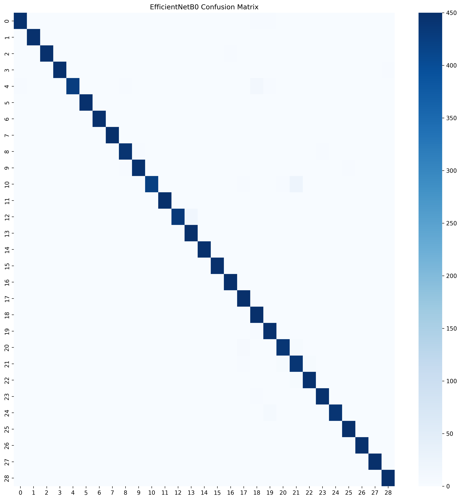

# Astronaut-Gesture-Recognition
# 🚀 Comparative Analysis of Transfer Learning Architectures for Astronaut Hand Gesture Recognition

## Project Overview

This project explores transfer learning for static hand gesture recognition inspired by astronaut command systems.

Three state-of-the-art CNN architectures were evaluated:

- ResNet50
- MobileNetV2
- EfficientNetB0

The models were trained on the ASL Alphabet Dataset containing approximately 87,000 gesture images across 29 classes.

---

## Dataset

ASL Alphabet Dataset

- Total Images: 87,000
- Classes: 29
- Image Size: 224 × 224

---

## Methodology

1. Data preprocessing
2. Image augmentation
3. Transfer learning
4. Fine-tuning
5. Model comparison
6. Performance evaluation

---

## Model Performance

| Model | Validation Accuracy | Test Accuracy |
|---------|---------|---------|
| ResNet50 | 80.98% | 80.11% |
| MobileNetV2 | 75.76% | 75.48% |
| EfficientNetB0 | **98.81%** | **98.87%** |

---

## Best Model

EfficientNetB0 achieved the highest performance:

- Test Accuracy: 98.87%

---

## Confusion Matrix

---

## Technologies Used

- Python
- TensorFlow / Keras
- NumPy
- Pandas
- Matplotlib
- Seaborn
- Scikit-Learn

---

## Future Work

- Grad-CAM Visualization
- Real-Time Webcam Gesture Recognition
- Streamlit Deployment
- Dynamic Gesture Recognition

---
